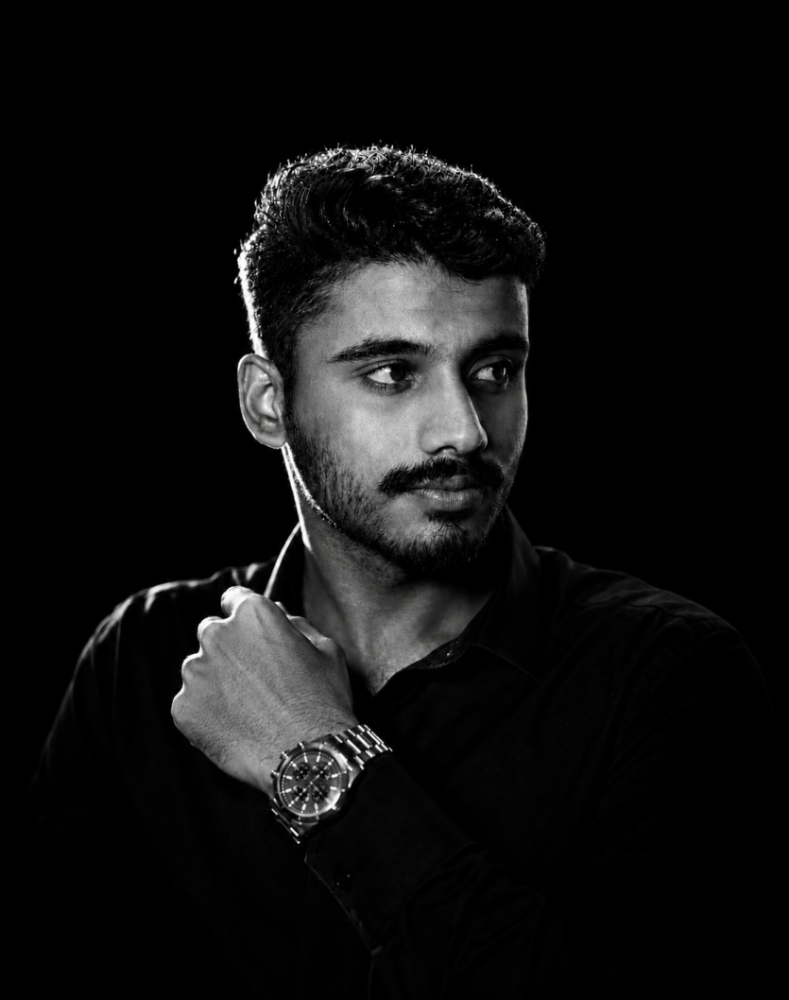

<!-- =========================================================
     AJLAN V — GITHUB PROFILE
========================================================== -->

# AJLAN V

### Flutter Developer

`Code.` `Learn.` `Build.` `Repeat.`

📍 Wayanad, Kerala, India

Building thoughtful apps for real-world problems.

 

 

---

## ⚡ ABOUT ME

I'm **Ajlan V**, a Flutter developer focused on building thoughtful,
practical applications for real-world problems.

I enjoy turning ideas into working products, exploring modern web
technologies, and continuously improving through code.

Currently expanding my skills beyond mobile development into
**Angular, web development, AI tools, and automation**.

---

## 🛠 TECH STACK

  

**Flutter** • **Dart** • **Angular**  
**HTML** • **CSS** • **Python (Basics)**

---

## 🚀 CURRENTLY

- Learning **Angular** and building web experiences
- Exploring **AI tools & automation**
- Building, learning, and improving through code

---

## ◈ FEATURED PROJECTS

### 💚 CashLog

**Personal cashflow management — privately, on-device.**

A Flutter application designed to track personal financial activity,
including income, expenses, lending, borrowing, and account-based
cashflows.

`Flutter` `Dart` `Local Storage` `Finance`

 

### 💜 PayMal

**Flutter UI implementation inspired by a modern wallet design.**

A UI-focused Flutter project created to explore modern mobile interface
design, reusable components, and clean application layouts.

`Flutter` `Dart` `UI/UX`

 

### 💗 MakeMyTrip Clone

**Angular recreation of the MakeMyTrip home experience.**

A web development project focused on recreating a modern travel platform
interface while learning Angular architecture and component-based
development.

`Angular` `HTML` `CSS` `TypeScript`

---

## ⚙️ TOOLS & TECHNOLOGIES

---

## 📊 GITHUB

  

---

### LET'S BUILD SOMETHING AMAZING

Building ideas. Learning continuously. Improving through code.

 

  

`Code. Learn. Build. Repeat.`

